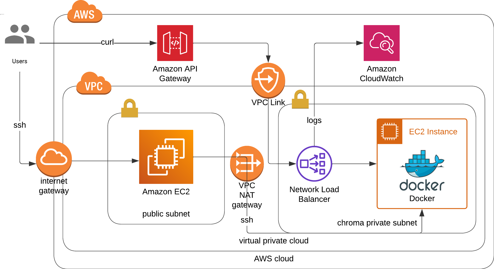

# aws-chromadb-terraform
The repository to deploy chromadb via terraform into aws cloud infrastructure.

## Architectures
1. Vanilla public ec2 instance [[code]](architectures/vanilla-ec2)
    - From the cloudformation template [here](https://s3.amazonaws.com/public.trychroma.com/cloudformation/latest/chroma.cf.json).
2. Public ec2 instance with API gateway [[code]](architectures/apigw-public-ec2/)
    - From the youtube video [How to run a Chroma Vector Database locally and on AWS! | EASY MODE](https://www.youtube.com/watch?v=xRIEKjOosaM)
3. (RECOMMENDED) Private ec2 instance with Network Load Balancer and API Gateway [[code]](architectures/apigw-nlb-ec2)
    - From the youtube video [Deploy a PRIVATE Chroma Vector DB to AWS | Step by step tutorial | Part 2](https://www.youtube.com/watch?v=rD3G3hbAawE&t=27s)



## How to deploy?
```bash
cd architectures/apigw-nlb-ec2 # change to another architecture directory
terraform init
terraform plan
terraform apply -auto-approve
```

## How to debug?
1. Visit chroma instance through backdoor instance.
```
ssh -i ssh-chroma.pem ec2-user@{public-backdoor-ip}
ssh -i ssh-chroma.pem ec2-user@{private-chroma-ip}
```
2. Inside chroma instance, test chroma heartbeat.
```
curl 0.0.0.0:8000/api/v1/heartbeat
docker ps
docker logs {docker-id}
```
3. Call api via api gateway with api key.
    - GET `https://******.execute-api.eu-west-2.amazonaws.com/v1/api/v1/heartbeat`
    - Authorization Type: API Key
    - Key: x-api-key
    - Value: {api key}
4. Call api with curl.
```
curl --location --request GET 'https://*******.execute-api.eu-west-2.amazonaws.com/v1/api/v1/heartbeat' \
--header 'x-api-key: ****'
```
5. Call api with python requests.
```
headers = {"x-api-key": "****"}
response = requests.get('https://*****.execute-api.eu-west-2.amazonaws.com/v1/api/v1/heartbeat', headers=headers)
print(response.text)
```
6. Read Cloudwatch logs from API-Gateway-Execution-Logs_xxxxxx.
7. Python sdk from chroma-core
```
import chromadb

client = chromadb.HttpClient(
    host="xxxxxx.execute-api.eu-west-2.amazonaws.com/dev", # don't include https
    ssl=True,
    port="",
    headers={
        "X-Api-Key": "xxxxx"
    }
)
print("Heartbeat: ", client.heartbeat())
print("List collections: ", client.list_collections())
```
