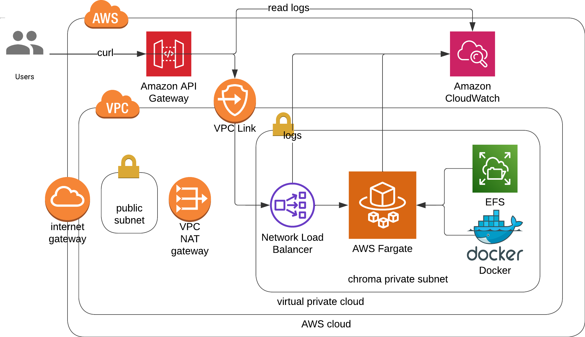
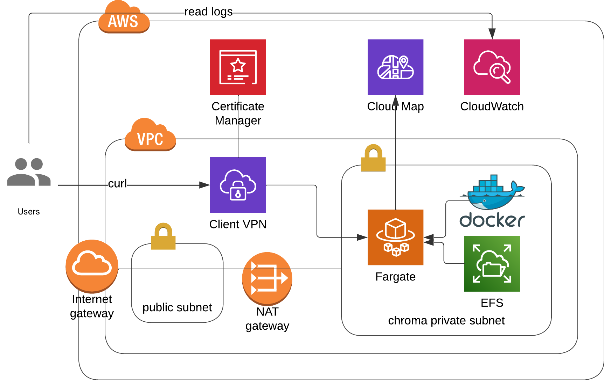

# aws-chromadb-terraform
The repository to deploy chromadb via terraform into aws cloud infrastructure, using API Gateway, NLB, EFS and Fargate.

|Architecture 3|Architecture 4|
|---|---|
|||
|Architecture 5||
|||

## Architectures
1. Vanilla public ec2 instance [[code]](architectures/vanilla-ec2)
    - Translated from the cloudformation template [here](https://s3.amazonaws.com/public.trychroma.com/cloudformation/latest/chroma.cf.json) to terraform.
2. Public ec2 instance with API gateway [[code]](architectures/apigw-public-ec2/)
    - Modified from the youtube video [How to run a Chroma Vector Database locally and on AWS! | EASY MODE](https://www.youtube.com/watch?v=xRIEKjOosaM)
    - Additional cloudwatch to view api gateway deployment.
3. Private ec2 instance with Network Load Balancer and API Gateway [[code]](architectures/apigw-nlb-ec2)
    - Modeified from the youtube video [Deploy a PRIVATE Chroma Vector DB to AWS | Step by step tutorial | Part 2](https://www.youtube.com/watch?v=rD3G3hbAawE&t=27s)
    - Additional cloudwatch to view api gateway deployment.
    - Additional public ec2 to view docker logs within private ec2.
4. (RECOMMENDED) Private ecs fargate with Network Load Balancer, EFS and API Gateway [[code]](architectures/apigw-nlb-ecs)
    - Fargate to manage docker containers.
    - Elastic File System for persistent volume of docker.
    - Cloudwatch Logs to store api gateway deployment messages and docker logs.
5. (RECOMMENDED) Private ecs fargate with EFS, Cloud Map and VPN Endpoint. [[code]](architectures/cloudmap-vpn-ecs)
    - Private microservices discoverable by Cloud Map.
    - Public access only with VPN client.
    - [IMPORTANT] Read [[this]](architectures/cloudmap-vpn-ecs/README.md) to set up your vpn properly.

## How to deploy?
```bash
cd architectures/{architecture-directory}
terraform init
terraform plan
terraform apply -auto-approve
```

## How to debug?
1. Remote access to ec2 instance.
    ```bash
    # architecture 1,2
    ssh -i ssh-chroma.pem ec2-user@{public-chroma-ip}
    sudo docker logs `sudo docker ps | grep chroma | awk '{ print $1 }'`
    # architecture 3
    ssh -i ssh-chroma.pem ec2-user@{public-backdoor-ip}
    ssh -i ssh-chroma.pem ec2-user@{private-chroma-ip}
    sudo docker logs `sudo docker ps | grep chroma | awk '{ print $1 }'`
    # architecture 4,5 (not applicable)
    ```
2. Curl
    ```bash
    # architecture 1.2
    curl http://{public-chroma-ip}:8000/api/v1/heartbeat
    # architecture 2,3,4
    curl --location --request GET \
        'https://*******.execute-api.eu-west-2.amazonaws.com/v1/api/v1/heartbeat' \
        --header 'x-api-key: ****'
    # architecture 5 (vpn on)
    curl http://test.service.internal:8000/api/v1/heartbeat
    ```
3. Postman (architecture 2,3,4)
    - GET
        - (architecture 1,2) `http://{public_chroma_ip}:8000/api/v1/heartbeat`
        - (architecture 2,3,4) `https://******.execute-api.eu-west-2.amazonaws.com/v1/api/v1/heartbeat`
        - (architecture 5 (vpn on)) `http://test.service.internal:8000/api/v1/heartbeat`
    - Authorization Type: API Key (architecture 2,3,4)
        - Key: x-api-key
        - Value: {api key}
4. Python requests
    ```python
    import requests
    # architecture 1,2
    uri = 'http://{public_chroma_ip}:8000/api/v1/heartbeat'
    headers = {}
    # architecture 2,3,4
    uri = 'https://*****.execute-api.eu-west-2.amazonaws.com/v1/api/v1/heartbeat'
    headers = {"x-api-key": "****"}
    # architecture 5 (vpn on)
    uri = 'http://test.service.internal:8000/api/v1/heartbeat'
    headers = {}
    # ------
    response = requests.get(uri, headers=headers)
    print(response.text)
    ```
5. Read Cloudwatch logs
    - from API-Gateway-Execution-Logs_xxxxxx. (architecture 2,3,4)
    - from chroma-container-logs. (architecture 4, 5) -> replace step 1
6. Python sdk from chroma-core
    ```python
    import chromadb

    # architecture 1,2
    hostname = '{public_chroma_ip}'
    ssl, port, headers = False, 8000, {}
    # architecture 2,3,4
    hostname = '*****.execute-api.eu-west-2.amazonaws.com/dev'
    ssl, port = True, ""
    headers = {"x-api-key": "****"}
    # architecture 5 (vpn on)
    hostname = "test.service.internal"
    ssl, port, headers = False, 8000, {}
    # ------

    client = chromadb.HttpClient(
        host=hostname, # don't include http or https
        ssl=ssl, port=port,
        headers=headers
    )
    print("Heartbeat: ", client.heartbeat())
    print("List collections: ", client.list_collections())
    ```
